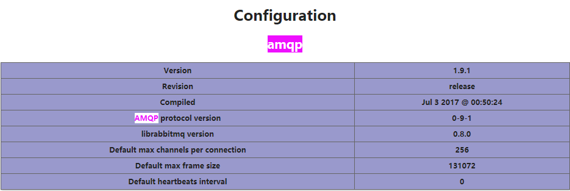

# 概述

# php端安装rabbitmq-c

url:https://github.com/alanxz/rabbitmq-c
```
cd rabbitmq-c****
./configure --prefix=/usr/local/rabbitmq-c
```
当看到下边的信息,表示rabbitmq-c配置成功
    rabbitmq-c build options:
    Host: x86_64-unknown-linux-gnu
    Version: 0.8.0
    SSL/TLS: openssl
    Tools: no
    Documentation: no
    Examples: yes

```make && make install```
# 安装php的amqp扩展

url:http://pecl.php.net/package/amqp
安装php的扩展,需要使用phpize ,读取现在php的配置需要php-config
如果不知道这两个文件在哪里,可以使用 find / -name phpize 来查找
```cd amqp-1.9.1```
```/opt/lampp/bin/phpize``` 
<注:只有在php扩展包里边才能执行phpize命令,否则会爆找不到config.4配置文件的错误>
``` ./configure --with-php-config=/opt/lampp/bin/php-config --with-amqp --with-librabbitmq-dir=/usr/local/rabbitmq-c

make && make install```

根据make install 提示
Installing shared extensions:     /opt/lampp/lib/php/extensions/no-debug-non-zts-20160303/
我们进入该文件夹
cd  /opt/lampp/lib/php/extensions/no-debug-non-zts-20160303/ 
已经可以看到里边有我们安装的扩展:amqp.so
但是通过访问phpinfo();还没有看到这个扩展的信息
3.配置扩展并重启web server
通过查看phpinfo引入扩展的文件夹

看到正是扩展所在的文件夹,如果不是,需要复制安装扩展.so文件到对应文件夹下
extension="amqp.so"


到这里表示安装php的amqp扩展完成,可以通过命令
/opt/lampp/bin/php -m |less来查看php加载的模块是不是有amqp了
访问phpinfo();也可以看到

4.composer安装php-amqplib/php-amqplib包
去composer网站 有提示
