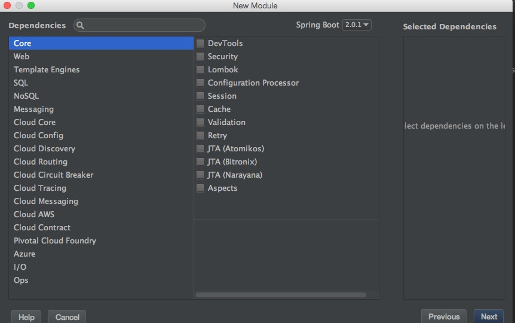
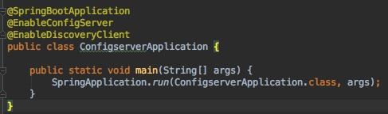
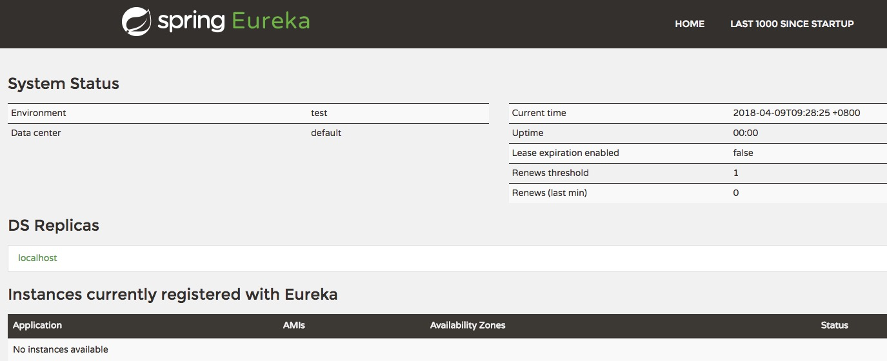
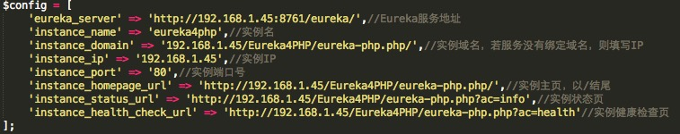
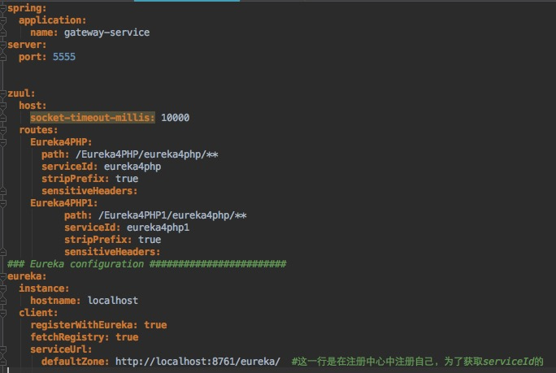
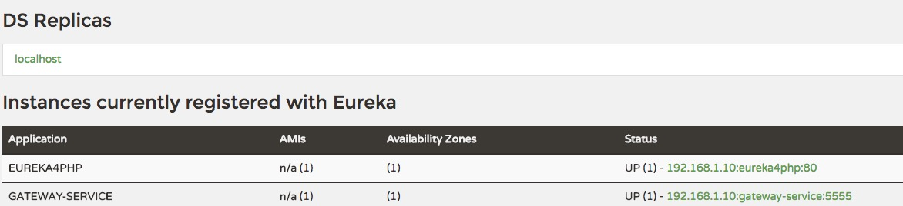

# SpringCloud 教程
## 开发工具
* IntelliJ IDEA

## SpringCloud整合php
> 1.首先创建一个maven主工程

>> 请参考：https://blog.csdn.net/m0_37499059/article/details/78416552

> 2.创建1个model工程(作为服务注册中心:eureka server)
>> 2.1 右键工程 -> New -> Module -> 选择spring initialir (注意下图所示,选择Core)
	
	
>> 2.2 修改配置pom.xml内容
  请参考代码eureka/pom.xml

>> 2.3 启动一个服务注册中心（找到启动application，添加@EnableDiscoveryClient和@EnableConfigServer，入下图所示）
  
  
>> 2.4 配置appication.yml
  
  ```java
  server:
  	port: 8761

  eureka:
  	client:
      register-with-eureka: false
      fetch-registry: false

  ```
   通过register-with-eureka：false和fetch-registry：false来表明自己是一个eureka server.
   
>> 2.5 eureka server 是有界面的，启动工程,打开浏览器访问： 
http://localhost:8761 ,界面如下：
   

> 3.Eureka客户端(PHP版，代码放在xampp的htdocs下)，将PHP端实现的服务注册到服务中心(eureka server)
>> 注意客户端配置如下：


> 4.创建API Gateway服务器（创建步骤和创建eureka server一样）
>> 4.1 修改配置pom.xml内容
  
  请参考代码gateway-service/pom.xml
>> 4.2 配置appication.yml内容如下
 

> 5.运行整个项目
>> 5.1 依次启动服务注册中心（eureka） 和 gateway

>> 5.2 php注册（先把apache服务开启）
>>> 浏览器中执行http://localhost/Eureka4PHP/eureka-php.php?ac=reg

>> 5.3 检查gateway和php 这两个客户端是否成功注册到注册中心（浏览器执行http://localhost:8761/）,出现下图结果表示正确
 

> 6. 通过网管服务可以访问php的接口
>> 6.1 浏览器执行http://localhost:5555/eureka4php/?ac=test1会出现

```java
接收参数：test1http://192.168.1.10/Eureka4PHP/eureka-php.php/:80/?ac=test1
```
表示成功

  
  
 